# Artsy PBS — Custom Order & Design Studio

A Laravel-based custom jewelry and charm builder — built on Tailwind CSS, Fabric.js, and Alpine.js with role-based access for Customers and Admins.

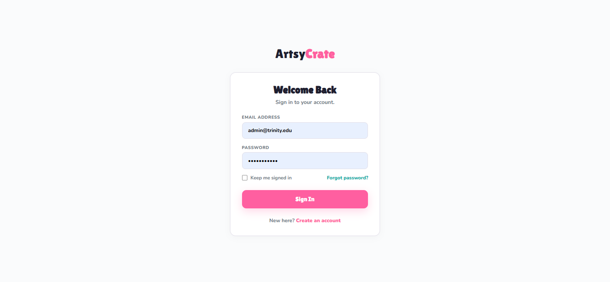

---

## Table of Contents
- [About](#about)
- [Screenshots](#screenshots)
- [Modules](#modules)
- [Tech Stack](#tech-stack)
- [Setup](#setup)
- [Roles](#roles)
- [Routes](#routes)

---

## About
Artsy PBS is a custom souvenir and accessories ordering platform where customers can design their own keychains, bracelets, and necklaces online — bead by bead, charm by charm. It features a live canvas builder powered by Fabric.js, a full order flow from design to confirmation, and an admin dashboard for managing orders, design approvals, and inventory.

---

## Screenshots

### Builder

| Page | Preview |
|------|---------|
| Bracelet Builder | 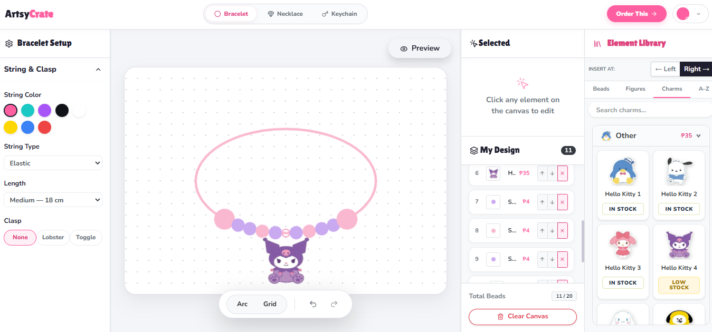 |
| Necklace Builder | 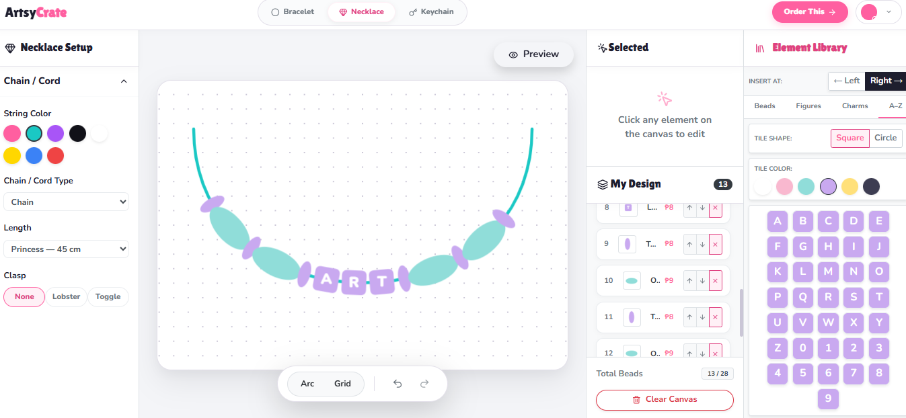 |
| Keychain Builder | 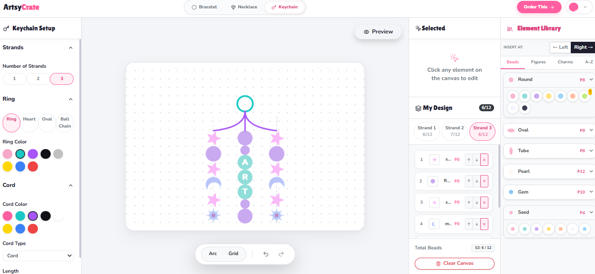 |

---

### Customer

| Page | Preview |
|------|---------|
| Dashboard | 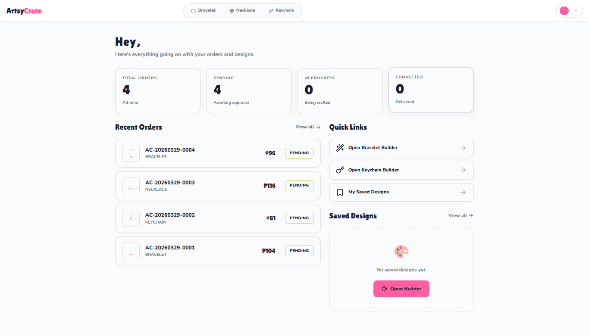 |
| My Orders | 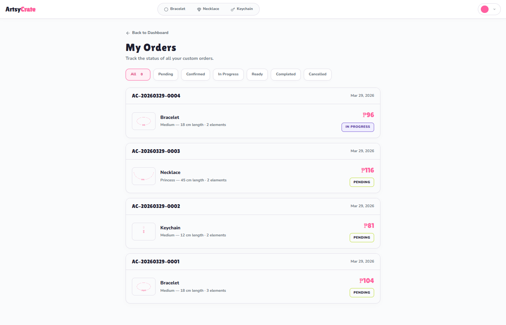 |
| Order Messages | 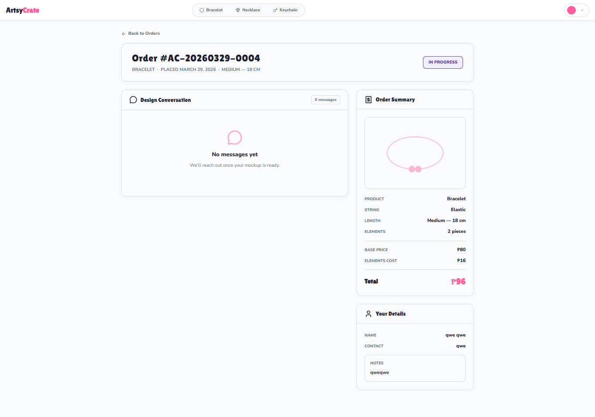 |
| Cart / Checkout | 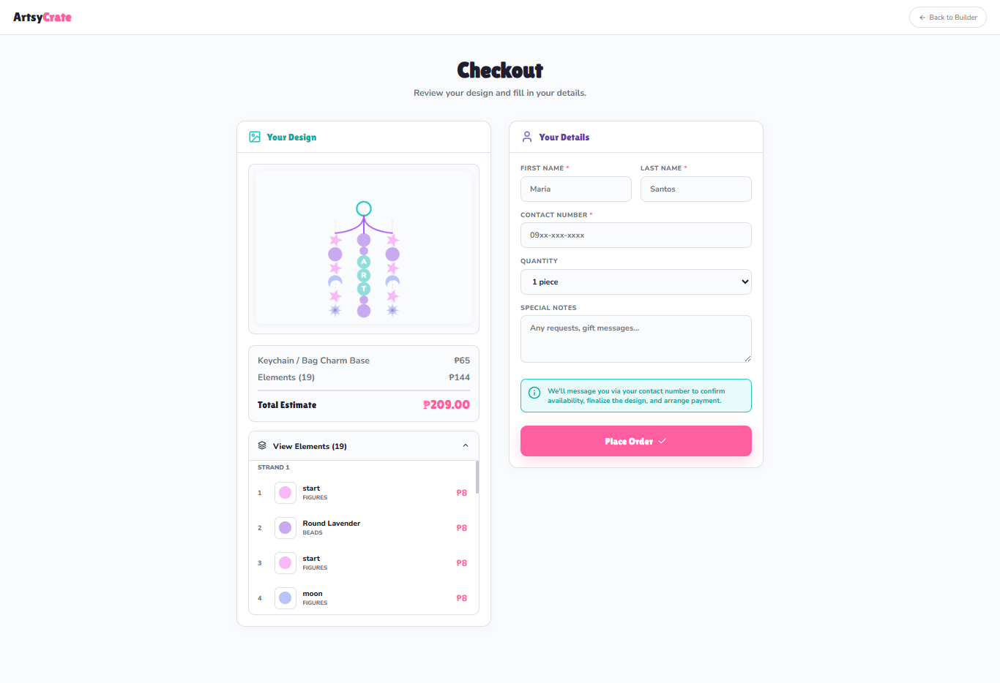 |

---

### Admin

| Page | Preview |
|------|---------|
| Orders Management | 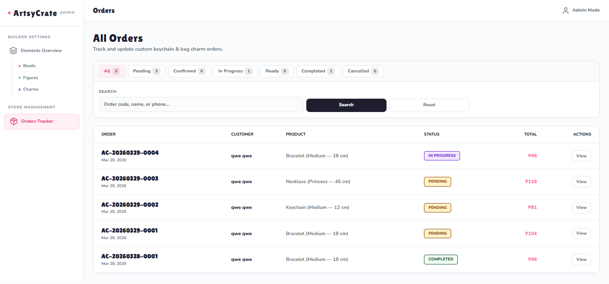 |
| Order Messages | 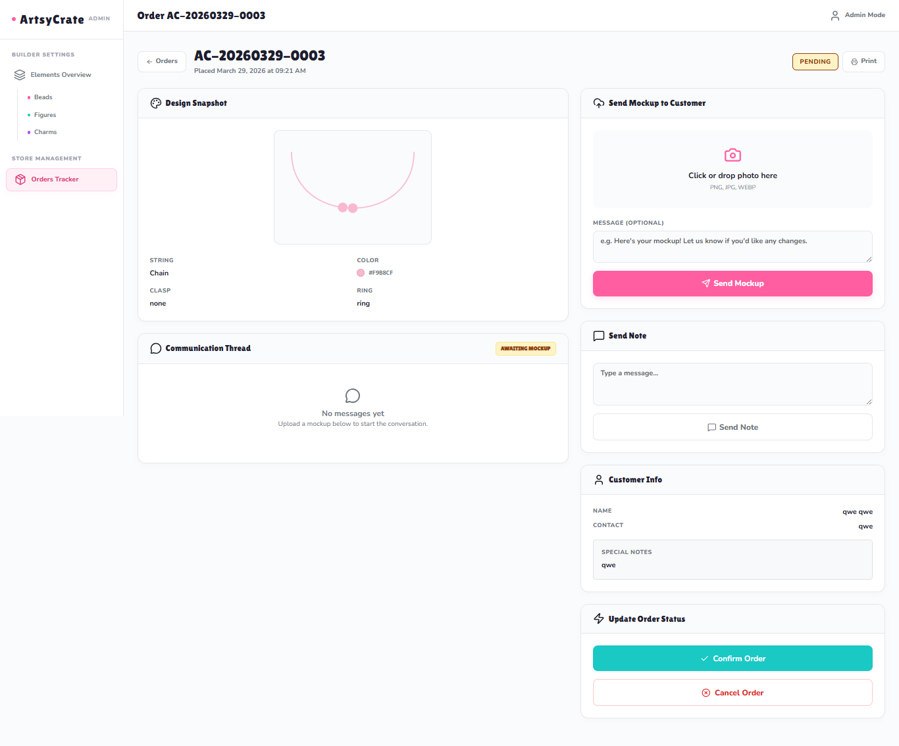 |
| Element / Inventory | 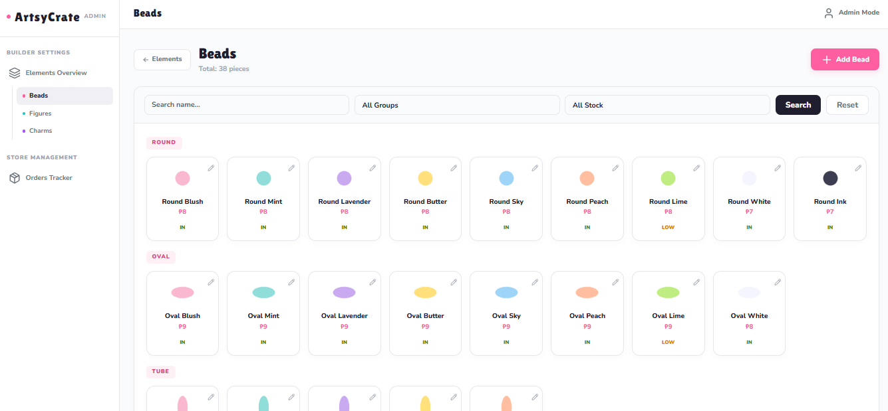 |
| Create Element | 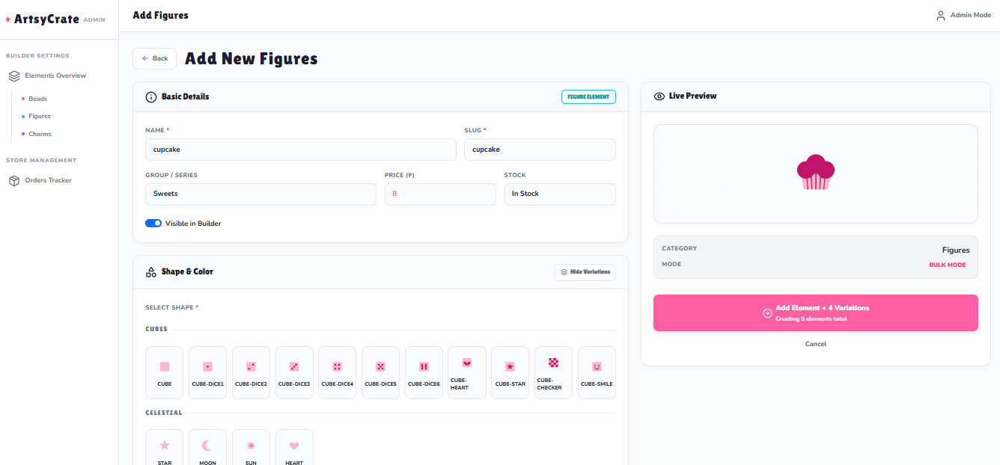 |

---

## Modules

### Phase 1 — Design Builder ⭐ Hero Feature
- Live canvas workspace powered by **Fabric.js**
- Drag-and-drop beads, charms, figures, and letter tiles onto a base product
- Color selection, resize, and reposition elements
- Design saved as **JSON snapshot + exported image** via Laravel Storage
- "Add to Order" carries the design snapshot into checkout

### Phase 2 — Order Submission & Tracking
- Customer fills out order form (quantity, notes, contact info)
- Design snapshot automatically attached to the order
- Unique order code generated on confirmation
- Customers can view and track order status from their account
- In-thread messaging for mockup approvals and revisions

### Phase 3 — Admin Dashboard
- View all incoming orders with design previews
- Update order status: `Pending → Confirmed → In Progress → Ready → Completed`
- Upload mockups and communicate with customers via order threads
- Basic order and approval tracking

### Phase 4 — Product / Inventory Management
- CRUD for charm and bead elements (what appears on the canvas)
- Category management: beads, figures, charms, letters
- Stock tracking per element (`in`, `low`, `out`)
- Toggle element visibility / active status

---

## Tech Stack

| Layer | Technology |
|-------|------------|
| **Backend** | Laravel 12 (PHP) |
| **Frontend** | Blade + Alpine.js |
| **Canvas** | Fabric.js |
| **Styling** | Tailwind CSS |
| **Database** | MySQL |
| **Auth** | Laravel Breeze (role-based: customer / admin) |
| **File Storage** | Laravel Storage (local or S3) |
| **Canvas Export** | Fabric.js `toDataURL()` → base64 → Laravel |

---

## Setup

```bash
git clone https://github.com/your-username/artsy-pbs.git
cd artsy-pbs
composer install
npm install && npm run dev
cp .env.example .env
php artisan key:generate
```

Update your `.env` with your database credentials:

```env
DB_DATABASE=artsy_pbs
DB_USERNAME=root
DB_PASSWORD=
```

Then:

```bash
php artisan migrate --seed
php artisan storage:link
php artisan serve
```

---

## Roles

| Role | Access |
|------|--------|
| `customer` | Design builder, order submission, order tracking, saved designs, order messages |
| `admin` | All orders, order status management, mockup uploads, element/inventory CRUD, order messages |

---

> Built with Laravel 12, Fabric.js & Tailwind CSS
